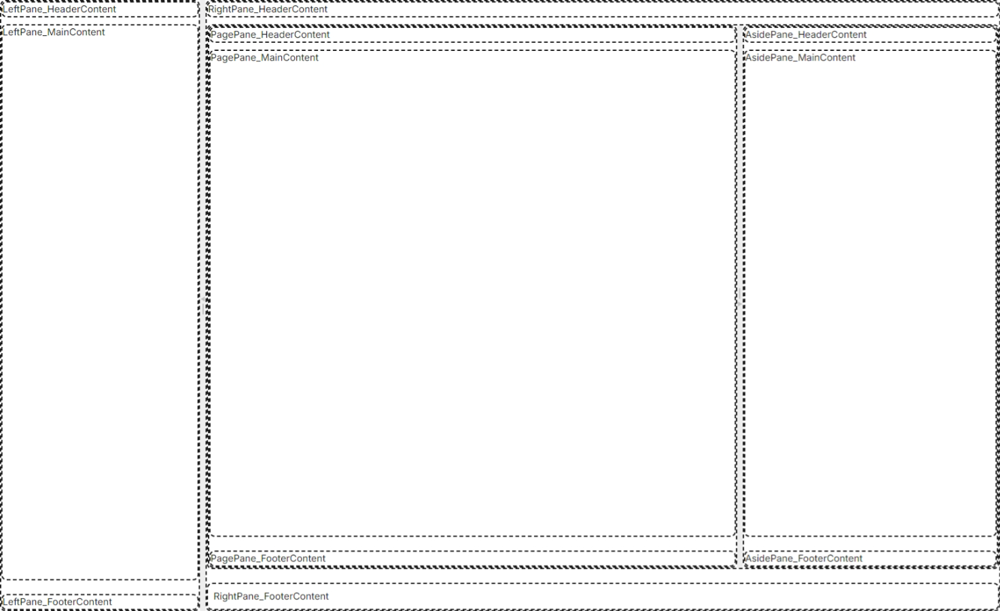

# TimeWarpPage Component

The TimeWarpPage component is a flexible and customizable layout component for creating pages with multiple panes. It uses the FluentMultiSplitter to create a responsive and adjustable layout.



## Layout Structure

The TimeWarpPage consists of two main sections:

1. Left Pane
2. Right Pane

Each pane is further divided into three sections:

1. Header
2. Main
3. Footer

The Right Pane also includes:

- Page Pane (Main content area)
- Aside Pane (Side content area)

## Component Features

- Customizable content areas through RenderFragment parameters
- Collapsible Left Pane
- Adjustable pane sizes
- Optional visibility for different sections
- Consistent Header-Main-Footer structure across all panes

## Parameters

### Content Parameters

- `LeftPane_HeaderContent`
- `LeftPane_MainContent`
- `LeftPane_FooterContent`
- `RightPane_HeaderContent`
- `RightPane_FooterContent`
- `PagePane_HeaderContent`
- `PagePane_MainContent`
- `PagePane_FooterContent`
- `AsidePane_HeaderContent`
- `AsidePane_MainContent`
- `AsidePane_FooterContent`

These parameters allow you to inject custom content into different areas of the page.

### Control Parameters

- `ShowLeftPane`: Controls the visibility of the Left Pane (default: true)
- `ShowSiteFooter`: Controls the visibility of the site footer (default: true)
- `ShowPlaceholders`: Controls the visibility of placeholder content (default: false)

## Usage

To use the TimeWarpPage component, you need to:

1. Inherit from it in your Razor component
2. Provide content for the desired sections using the content parameters
3. Optionally, adjust the control parameters to customize the layout

Example:

```razor
@namespace TimeWarp.Architecture.Pages
@inherits BaseComponent

<TimeWarpPage ShowPlaceholders=true>
  <LeftPane_HeaderContent>
    LeftPane_HeaderContent
  </LeftPane_HeaderContent>
  <LeftPane_MainContent>
    LeftPane_MainContent
  </LeftPane_MainContent>
  <LeftPane_FooterContent>
    LeftPane_FooterContent
  </LeftPane_FooterContent>
  <RightPane_HeaderContent>
    RightPane_HeaderContent
  </RightPane_HeaderContent>
  <RightPane_FooterContent>
    RightPane_FooterContent
  </RightPane_FooterContent>
  <PagePane_HeaderContent>
    PagePane_HeaderContent
  </PagePane_HeaderContent>
  <PagePane_MainContent>
    PagePane_MainContent
  </PagePane_MainContent>
  <PagePane_FooterContent>
    PagePane_FooterContent
  </PagePane_FooterContent>
  <AsidePane_HeaderContent>
    AsidePane_HeaderContent
  </AsidePane_HeaderContent>
  <AsidePane_MainContent>
    AsidePane_MainContent
  </AsidePane_MainContent>
  <AsidePane_FooterContent>
    AsidePane_FooterContent
  </AsidePane_FooterContent>
</TimeWarpPage>
```

This example demonstrates how to use all available content parameters of the TimeWarpPage component. The `ShowPlaceholders=true` parameter is used to display placeholder content in each section, which can be helpful during development or for demonstration purposes.

## Customization

You can customize the TimeWarpPage by:

1. Adjusting the `Size`, `Min`, and `Max` properties of the FluentMultiSplitterPanes
2. Modifying the `ShowLeftPane`, `ShowSiteFooter`, and `ShowPlaceholders` parameters
3. Implementing custom styles for the different panes and content areas
4. Overriding the default Header, Main, or Footer components for each pane

## Notes

- The Left Pane is collapsible and has a default size of 20% with a minimum width of 275px and a maximum of 70% of the total width.
- The Right Pane takes up the remaining space (default 80%).
- The component uses `CascadingValue` to pass itself down to child components, allowing for further customization in nested components.
- Each pane (Left, Right, Page, and Aside) follows a consistent Header-Main-Footer structure.
- The `ShowPlaceholders` parameter can be used to display placeholder content in each section, which is useful for development and demonstration purposes.

Remember to follow the coding standards specified in your project, such as using PascalCase for public properties and camelCase for local variables.
