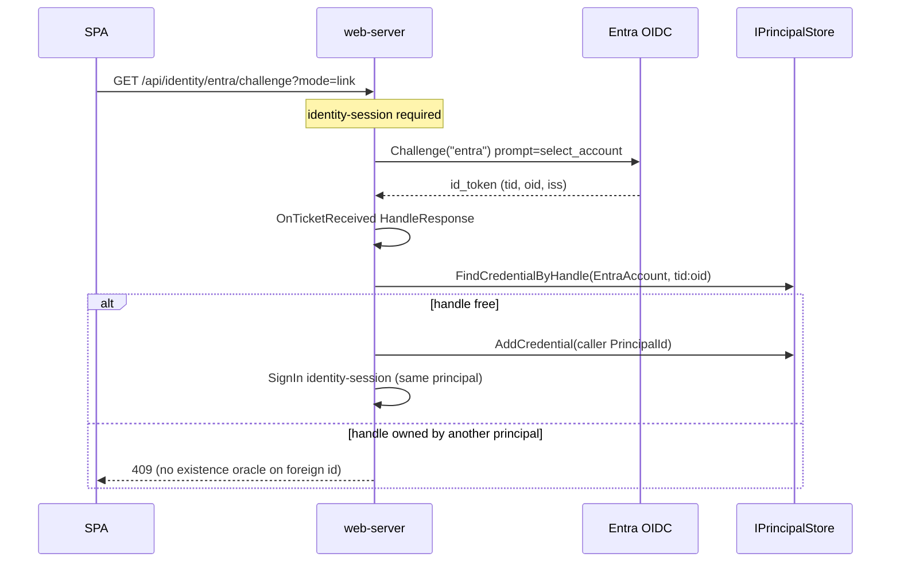
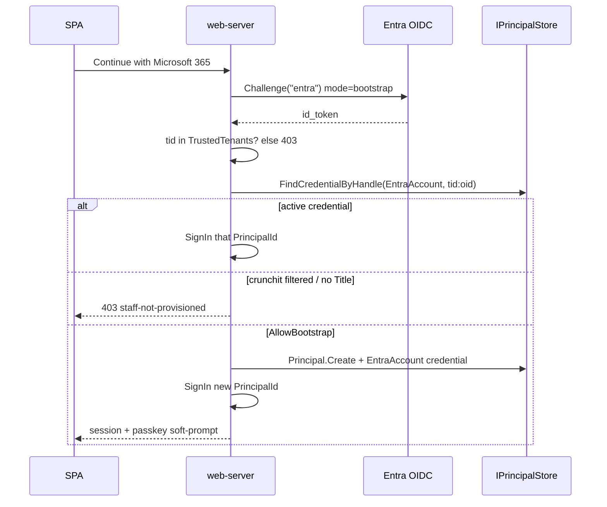
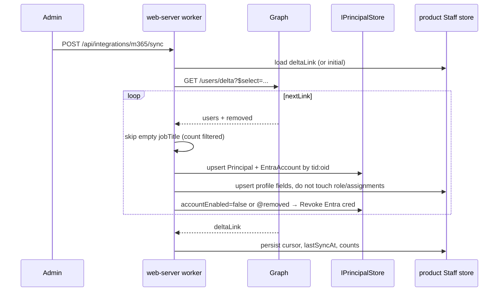

# RFC: Entra ID as a linked credential on passkey principals plus tenant user sync

**Status:** **Resolved 2026-09-14** (ballots + maintainer). Fold-in on host **219** is this RFC + Results + child kitchens — library Design regions land on the identity children. Sidecars: `general-purpose-a-ballot.md`, `general-purpose-b-ballot.md`, `adversarial-c-ballot.md`.
**Host task:** 219 — kitchen for RFC + fold-in (agent-collaboration same-task rule). Do **not** spawn an “apply resolutions” sibling.
**Author:** rfc oracle (Grok 4.6), 2026-09-14.
**Audience:** Independent reviewers. Append a ballot under [Reviewer opinions](#6-reviewer-opinions)
using the template. Do **not** rewrite others' entries.

> Files under `rfc/` are debate material. Authoritative after fold-in: this task’s Results,
> child implementation kitchens, and (when those land) TimeWarp.Identity Design regions / code.
> Do not treat this text as a rule until folded in.

**Balloted:** Decisions **2, 5, 7**. Fork **1 is locked** (Steve, 2026-09-14) and is **not** reopened.
Decisions 3, 4, 6, 8, 9, 10 are resolved in prose so reviewers can object under
“Anything the author missed” rather than as numbered votes.

---

## 1. Why this exists

TimeWarp.Identity is passkey/key-first (`Principal` + 1:N `Credential`, program locks #1, #9, #10).
Entra/MSAL in the template today (104-021) is a **parallel default-scheme** (`Authentication:UseEntra`)
that never touches `Principal`/`Credential`. Crunchit staff live in the `crunchitfs.com` workforce
tenant and the portal mockup expects “Continue with Microsoft 365”, an M365-synced Staff list, and
portal-owned role/status/assignments.

This RFC picks the mechanics so child tasks can extend a passkey-first principal with a **linked
Entra identity** and so a product can **pre-provision** principals from an existing Entra tenant
without making Entra External ID the center (non-goal).

### Out of scope

- Implementing the library/template/crunchit changes (child tasks after tally)
- Entra External ID / CIAM as primary identity
- Entra’s own FIDO2/synced passkeys (separate credential store; no interaction)
- ADAL / Azure AD Graph (retired)
- Progressive profile product work on task **205** except the ownership split in D6
- Live tenant round-trips in this worktree (no app registration / Graph app-only creds here)

### In scope

- Locked fork 1 mechanics (bootstrap-capable Entra as a first-class credential)
- Three contested forks (credential shape, sync mechanism, job placement)
- Prose resolutions for trust tier, step-up, profile ownership, onboarding, revocation, UseEntra
- Public surface delta, sequence diagrams, child-task split

---

## 2. Sources of truth (evidence)

| # | Source | Path / ref | Nature |
|---|--------|------------|--------|
| A | Identity domain | `source/libraries/timewarp-identity/` (`Credential`, `CredentialType`, `Principal`, `TrustTier`, `IPrincipalStore`) | Product truth today |
| B | EF unique index | `credential-entity-type-configuration-infrastructure.cs` unique `(Type, Handle)`; `PublicMaterial` `bytea` required | Persistence belt |
| C | Attach ceremony | 104-005: `AddPasskey` / `AddAgentKey` / `GetCredentials` / `RevokeCredential`; policy + last-active guard | Seam for Entra attach |
| D | Entra parallel path | 104-021 + `web-server/program.cs` `Authentication:UseEntra` → `AddMicrosoftIdentityWebAppAuthentication` as **default** scheme | The story to retire |
| E | Program locks | `kanban/done/104-agent-ready-identity-and-x402-program/task.md` #1, #9, #10; non-goal Entra External ID | Product law |
| F | Plane split | 118 Notes: **web = human plane** (ceremonies, cookies); **api = agent plane** (bearer/x402) | Host placement |
| G | Crunchit mockup | `crunchit/documentation/design/crunchit-portal.html` Staff page (M365 card lives **here**, not Settings), sign-in | Expected *functionality* |
| H | Crunchit contracts | `features/staff/*`, `features/integrations/{connect,get,sync}-m365`; list key = `StaffId` slug; email is invite uniqueness | Mock-era surface |
| I | Crunchit 008 | `kanban/to-do/008-plan-entra-id-auth-and-role-model.md` | Open: SWA vs MSAL, groups vs app roles |
| J | Entra claims | [ID token claims reference](https://learn.microsoft.com/en-us/entra/identity-platform/id-token-claims-reference) (updated 2026-06-15) | `tid`+`oid`; `sub` pairwise; email/UPN mutable |
| K | Graph delta | [delta-query-users](https://learn.microsoft.com/en-us/graph/delta-query-users), [delta-query-overview](https://learn.microsoft.com/en-us/graph/delta-query-overview) | `$select` on initial; **user `$filter` is object-id only** |
| L | Identity.Web 4.x | [AddMicrosoftIdentityWebAppAuthentication](https://learn.microsoft.com/en-us/dotnet/api/microsoft.identity.web.microsoftidentitywebappservicecollectionextensions.addmicrosoftidentitywebappauthentication?view=msal-model-dotnet-latest); [multiple schemes wiki](https://github.com/AzureAD/microsoft-identity-web/wiki/multiple-authentication-schemes) | Named OIDC scheme is supported; helper **must not** become DefaultScheme |
| M | ASP.NET Core 10 OIDC | [Configure OIDC web authentication](https://learn.microsoft.com/en-us/aspnet/core/security/authentication/configure-oidc-web-authentication?view=aspnetcore-10.0) | Cookie default + named OIDC challenge; BFF recommended; WASM public client is not |
| N | Soft-prompt prior art | archived 098-006; 104-005 deferred recovery UX | Passkey after Entra is a prompt, not a gate |

### Evidence matrix (selected dimensions)

| Dimension | Today (A–D) | Crunchit (G–I) | Entra docs (J–M) |
|-----------|-------------|----------------|------------------|
| Auth center | identity-session cookie; UseEntra flips default to Entra | Mock role picker; “Continue with Microsoft 365” | BFF confidential client; named scheme possible |
| Join key | `(CredentialType, Handle)` unique | StaffId + **email** | **`tid`+`oid`**; never email/UPN/`sub` |
| Credential types | `None/Passkey/AgentKey`; `PublicMaterial` non-empty | n/a | Entra is not a public key; issuer is the pin |
| First credential | `AddCredentialAsync` → Provisional→Keyed | n/a | Entra token = accepted credential (fork 1 locked) |
| Directory sync | none | Mock Sync now + “no Title” filter | Graph `/users/delta`; **filter jobTitle client-side** |
| Roles | template permissions | owner/admin/staff **app-assigned** | Entra groups optional; overage → Graph anyway |
| Job host | ceremonies on web (104-030) | BFF web-server (048) | App-only Graph (cert / managed identity) |

### Spike findings (throwaway — not merged)

Live Entra/Graph round-trips were **not** executed in this worktree (no app registration, no
client secret, no Graph app-only cert). The following are verified against current docs/API
surface, not against a running tenant.

1. **Named scheme, not default.** Identity.Web 4.x
   `AddMicrosoftIdentityWebApp(section, openIdConnectScheme, cookieScheme)` accepts a named
   OIDC scheme. `AddMicrosoftIdentityWebAppAuthentication` (what 104-021 calls) is the helper
   that tends to own DefaultScheme — **do not use it** for this design. Register
   `AddAuthentication(IdentitySessionDefaults.Scheme)` then
   `AddMicrosoftIdentityWebApp(..., openIdConnectScheme: "entra", cookieScheme: null)`
   (or raw `AddOpenIdConnect("entra")`) so identity-session stays default.
2. **Link-not-sign-in.** Official samples sign *in* with OIDC as DefaultChallengeScheme.
   Suppressing that is ASP.NET Core, not an Identity.Web first-class “link” API:
   `OpenIdConnectEvents.OnTicketReceived` → validate `tid`/`oid` → attach or bootstrap →
   `context.HandleResponse()` → `SignInAsync(identity-session)` → redirect. Do **not** let
   the OIDC handler sign in as the ambient user. `prompt=select_account` on the challenge.
3. **Graph `$filter` on `jobTitle` is not valid for user delta.** User/group delta `$filter`
   is **object-id only**. Initial request uses
   `$select=id,displayName,jobTitle,officeLocation,department,mail,accountEnabled`.
   Skip empty `jobTitle` in the **product merge**, not in Graph. Persist `@odata.deltaLink`;
   honour 429 `Retry-After`; treat `410 Gone` / `syncStateNotFound` as full resync.
   Directory delta tokens last **seven days**.
4. **Packages.** Keep `Microsoft.Identity.Web` 4.14.2 (already in CPM). Graph SDK for **new**
   product work is **6.x** (NuGet 6.6.0 as of 2026-09); do not pin the kitchen’s stale 5.25.0.
   Add `Microsoft.Graph` + `Azure.Identity` on the **product** that syncs, not on
   TimeWarp.Identity. Prefer `ClientCertificateCredential` / managed identity over a broad
   `DefaultAzureCredential` in production. ADAL / Azure AD Graph: do not use.

---

## 3. Objective (already decided — not balloted)

| Item | Status |
|------|--------|
| Fork 1 bootstrap-capable | **LOCKED 2026-09-14 by Steve.** “Continue with Microsoft 365” may create the account. Entra is a first-class credential; passkey is a soft prompt afterward (098-006 shape), never a gate. Guardrails: only explicitly configured trusted tenants may bootstrap; never auto-link by email; join key is `tid:oid`. Crunchit: first sign-in links to the pre-synced principal by `tid:oid`; a sync-filtered (no Title) account is refused. Template (no sync): first sign-in from a trusted tenant creates the principal. |
| Passkeys stay first-party WebAuthn | Entra FIDO2 is a different store (no interaction) |
| Entra External ID as primary | Non-goal (program 104) |

### Locked fork 1 — mechanics this RFC designs (not a vote)

Three inbound Entra ticket paths, all on the **named** `entra` scheme:

| Path | Precondition | Result |
|------|--------------|--------|
| **Bootstrap** | Anonymous + `AllowBootstrap` + `tid` ∈ TrustedTenants + no existing `(EntraAccount, tid:oid)` | `Principal.Create(Human)` + `Credential.Create(EntraAccount, …)` + identity-session. Soft-prompt passkey. |
| **Sync hit** | Anonymous or authenticated; `FindCredentialByHandleAsync(EntraAccount, tid:oid)` finds an **active** credential | Issue identity-session for that `PrincipalId`. No second principal. |
| **Link** | Authenticated identity-session; no existing Entra handle on **any** principal | `AddCredentialAsync` on `HttpContext.User`’s principal. Refuse if handle already bound elsewhere (409, no oracle — same as 104-005 duplicate handle). |
| **Filtered refuse** | Crunchit product: Graph user has no `jobTitle` (or Staff row marked filtered) | Do not bootstrap; do not issue a session. |

Email is display/search only. `sub` is pairwise per app — never a join key.

---

## 4. Decisions

Reviewers vote **Decision 2, 5, 7** by number + short topic. Prose decisions (3, 4, 6, 8, 9, 10)
are author resolutions; flag disagreement under “Anything the author missed”.

### Decision 2 — Credential shape *(balloted)*

**Topic:** How is an Entra identity stored on a `Principal`?

`Credential.Create` today rejects empty `PublicMaterial`. EF maps it `bytea` required.
`FindCredentialByHandleAsync(type, handle)` + unique `(Type, Handle)` is the lookup the
bootstrap/link/sync paths need.

| Option | Description |
|--------|-------------|
| **A. `CredentialType.EntraAccount` + handle `tid:oid` + issuer as `PublicMaterial`** | New enum value `EntraAccount = 3`. `Handle` = UTF-8 `"{tid}:{oid}"` (canonical lowercase GUIDs). `PublicMaterial` = UTF-8 issuer `https://login.microsoftonline.com/{tid}/v2.0` (pinned at attach; verification is OIDC token validation, not a public-key verify). Helpers `EntraAccountHandle` / `EntraIssuerMaterial` in the library. |
| **B. Generic `CredentialType.ExternalIdentity`** | One type for all IdPs; provider name in label or material JSON. |
| **C. Separate `ExternalIdentity` table** | ASP.NET Identity `AspNetUserLogins` shape: `(LoginProvider, ProviderKey) → PrincipalId`. `Credential` stays passkey/agent-key only. |

**Trade-offs:** A reuses the 1:N credential model, last-active counting, list/revoke, unique index,
and `GetCredentials` with no second aggregate. It documents that `PublicMaterial` is
**verification material**, not always a COSE key — Entra’s pin is the issuer. B is extra
indirection before a second provider exists (enum can grow later). C splits “what can sign you in”
across two tables, so last-credential and `FindCredentialByHandleAsync` no longer tell the truth;
sync/bootstrap become a second store port.

**Author lean: A.** YAGNI on generic provider; do not fork the credential aggregate.
**Tally:** **A′** — same aggregate, plus a type-dependent PublicMaterial contract and `Credential.Restore()` in the identity child (see §7.1).

---

### Decision 3 — Trust tier *(prose)*

**Resolution: Entra counts as Keyed. No new tier. No quarantine-by-default for synced rows.**

`TrustTier.Keyed` already means “has at least one credential” (`RecordCredentialAttached` on first
`AddCredentialAsync`). Fork 1 says an Entra token satisfies “account = accepted credential” the
same way a passkey does. A sync-created principal therefore goes Provisional → Keyed when the
Entra credential is inserted.

Quarantine stays a risk flag (`IsQuarantined`), not “has no passkey yet”. Soft-prompt (D8) is UX,
not a tier. Funded/Established unchanged (x402 / reputation).

---

### Decision 4 — Step-up *(prose)*

**Resolution: identity-session cookie is sufficient to *link* Entra. No passkey re-assert.**

104-005 already attaches passkeys and agent keys from the credential-management policy without
re-proving the original authenticator. Cookie theft already implies add-credential. If step-up
is added later, it applies to **all** attaches, not Entra alone.

Bootstrap is anonymous by design (fork 1) — there is no session to step up.

---

### Decision 5 — Sync mechanism *(balloted)*

**Topic:** How does a product pre-provision principals from a workforce tenant?

| Option | Description |
|--------|-------------|
| **A. Graph delta pull (primary) + JIT complement** | App-only `User.Read.All` (cert or managed identity). Initial `GET /users/delta?$select=id,displayName,jobTitle,officeLocation,department,mail,accountEnabled` then follow `nextLink` until `deltaLink`. Persist `deltaLink`. Client-side skip when `jobTitle` is null/empty. `@removed` / `accountEnabled=false` → D9. JIT at first sign-in **complements** (template has no sync; crunchit still pre-provisions). Roles: **app-assigned** in the product (mockup owner/admin/staff + per-user financials override). Group→role mapping is out of v1 (group overage already pushes you to Graph). Optional Graph change notifications = later wake-up, not v1. |
| **B. SCIM receiver** | Host a SCIM endpoint; Entra provisioning pushes users (~40 min cadence); disable → `active:false`. |
| **C. JIT only** | No directory pull. First Entra sign-in creates/links. Staff list is empty until people sign in. |

**Trade-offs:** A matches the mockup (Staff list before first login, Sync now, freshness,
filtered count) and is the Graph-recommended incremental pattern. `$filter=jobTitle ne null`
**cannot** be pushed to user delta (object-id filters only) — product merge applies the Title
rule. B needs a public SCIM endpoint, secret, and ~40 min lag; worse for “Sync now”. C cannot
show a directory or refuse no-Title accounts until sign-in (crunchit refuse-at-signin would
404 with no Staff row to explain).

**Author lean: A.** SCIM deferred. JIT remains the template path (no Graph client in
TimeWarp.Identity).
**Tally:** **A′** — delta is the only cursor SSOT; filtered GET is diagnostic only; Title-cleared deltas deprovision.

Field mapping (product Staff, not the identity library):

| Graph | Destination |
|-------|-------------|
| `id` (`oid`) + configured `tid` | `EntraAccount` handle |
| `displayName` | `Principal.DisplayName` + Staff name |
| `jobTitle` | Staff title; empty → **do not provision** / refuse bootstrap |
| `officeLocation` | Staff office |
| `department` | Staff department |
| `mail` | Staff email (mutable; **not** a join key) |
| `accountEnabled` | D9 |

---

### Decision 6 — Where profile fields live *(prose)*

**Resolution: Identity owns `Principal.DisplayName` (and credentials). Product owns Staff HR
and authorization data keyed by `PrincipalId`.**

| Field | Owner |
|-------|--------|
| `PrincipalId`, `Kind`, `TrustTier`, `IsQuarantined`, credentials | TimeWarp.Identity |
| `DisplayName` | Identity (sync may `SetDisplayName` from Graph) |
| Title, office, department, mail, hidden, role, status, assignments, financials override, invite token, last-synced | Product (crunchit Staff slice) |
| Progressive email/prefs update API | Task **205** / template profile — not a sign-in gate |

Do not grow `Principal` into an HR record. Do not put portal roles on Entra app roles in v1
(crunchit already leans app-assigned; per-user financials override does not fit groups).

---

### Decision 7 — Sync job placement *(balloted)*

**Topic:** Where does the Graph delta worker run, given the 118 plane split and TWA0009?

| Option | Description |
|--------|-------------|
| **A. web-server hosted service (human plane)** | `IHostedService` / periodic timer on the BFF that already owns identity ceremonies (104-030: “ceremonies stay on web”). `POST api/integrations/m365/sync` (“Sync now”) is the same process: acquire a lock, run one delta page-loop, write cursor + audit. Product slice (`Features.Integrations` / Staff) owns Graph client, cursor table, filter, Staff upsert. TimeWarp.Identity stays Graph-free. |
| **B. api-server (agent plane)** | Sync on the bearer/x402 host. |
| **C. New worker host** | Dedicated Aspire resource for Graph pull. |

**Trade-offs:** A colocates “Sync now”, admin audit, and human-directory UX with the plane that
already talks to `IPrincipalStore` for ceremonies. App-only Graph is not a user cookie flow; it
is still a **staff-directory** concern, not an agent marketplace concern. B violates 118
(api = agents). C is right at multi-tenant / multi-replica scale; premature for one workforce
tenant and a small directory. Multi-replica web-server: use a Postgres advisory lock (or
cursor `UPDATE … WHERE`) so only one replica runs a cycle.

**Author lean: A.** Cursor + audit tables are **product** postgres, not a TimeWarp.Identity port.
Template ships **no** sync job (bootstrap-only). Aspire worker is a later extraction if lock
contention or Graph throttling demands isolation.
**Tally:** **A′** — web-server v1 framed as **ops/directory**, not 118 human-ceremony plane; child lists extraction triggers.

Scheduler: default pull every 15–60 minutes + on-demand Sync now. Honour 429. Persist
`deltaLink` and `lastSyncAt`. Idempotent upsert on `(Type, Handle)`.

---

### Decision 8 — Onboarding a synced principal to its first passkey *(prose)*

**Resolution: Entra-bootstrap-or-sync-hit issues the session; passkey is a soft prompt.
Manual-add uses an invite token as the association key — never email auto-link.**

- **Synced user:** Principal+`EntraAccount` already exist (Keyed). First M365 sign-in is a
  sync hit. SPA shows 098-006-style “Add a passkey” if `GetCredentials` has no `Passkey`.
- **Template (no sync):** Bootstrap creates the principal; same soft prompt.
- **Manual add (mockup “Add staff manually”):** Product creates a Staff row + invite token
  **without** an Entra handle. Claim options: (1) passkey register bound to the token, or
  (2) Entra challenge with the invite token in `AuthenticationProperties.Items` so bootstrap
  binds to **that** Staff/`PrincipalId` instead of minting a second one. Email match is
  **not** a join. The mockup’s “set password” invite copy is a fossil — TimeWarp.Identity has
  no passwords; the token binds passkey or Entra, never a password.
- **Later Entra appears for a passkey-only manual principal:** authenticated **link** (D1/D4)
  from that session, or an admin reconcile command. Sync that sees an unknown `tid:oid`
  creates a **new** principal; if a manual Staff row shares email, surface
  “unlinked manual staff” for admin — do not merge.
- **Sync-filtered (no Title) user** who still tries M365: refuse (fork 1). They are not
  onboarded.

Last-active-credential (104-005) stays for **self-service** `RevokeCredential`. Adding a
passkey to an Entra-only principal is `AddPasskey` (existing). Revoking Entra when a passkey
exists is allowed. Revoking the last credential is still 409 for the user.

---

### Decision 9 — Revocation *(prose)*

**Resolution: Entra disable/delete revokes the `EntraAccount` credential (system path).
Session kill is the relying party’s job. Product policy decides whether passkey sign-in
still works.**

Graph: `accountEnabled=false` or `@removed` (`changed` = soft-deleted, `deleted` = gone).
Sync job: `credential.Revoke()` + `UpdateCredentialAsync` — **not** the HTTP
`RevokeCredential` handler, so the last-active 409 does not block a directory lockout.

Identity-session is a cookie without a denylist today. After Entra revoke:

- **Crunchit (desired lockout):** treat revoked Entra on a synced staff principal as
  “cannot use the portal”. Kill ambient sessions (principal version bump checked at
  session read, or a small session-epoch on `Principal` — implementation child). Passkey
  sign-in also refused while the Entra credential is revoked (staff tools follow the
  tenant). Re-enable in Graph → un-revoke or attach a new Entra credential (handles are
  immutable; a new credential row with the same handle is blocked by the unique index —
  **implementation must revive the same row** or mint a new handle only if `oid` changed,
  which it does not). Prefer **clear `RevokedAt` via a dedicated restore** on the same
  credential id, or replace-with-new-id after deleting the unique row. Child task: pick
  restore-in-place (add `Credential.Restore()` one-shot inverse of `Revoke`) vs delete row.
  **Author note for implementers:** `Restore()` on the same row is the smaller unique-index
  change; call it out in the identity child. Not balloted here because it is a follow-on
  invariant, not a fork among 2/5/7.
- **Template:** Entra optional. Revoked Entra leaves passkey sign-in working unless the
  product says otherwise.

Entra docs: [Revoke user access](https://learn.microsoft.com/en-us/entra/identity/users/users-revoke-access)
— the RP must drop its own sessions; Entra will not.

---

### Decision 10 — Retire `UseEntra` *(prose)*

**Resolution: one Entra story. identity-session is always DefaultScheme. Entra is a named
challenge scheme. Delete the 104-021 “Entra owns default” branch.**

| Today (104-021) | After |
|-----------------|--------|
| `Authentication:UseEntra=true` → `AddMicrosoftIdentityWebAppAuthentication` default + named identity-session | `Authentication:Entra:Enabled=true` → named scheme `entra`; default remains identity-session |
| SPA: MSAL + `AzureAdB2C` when flag on | SPA: “Continue with Microsoft 365” → BFF `Challenge("entra")`. No WASM public-client MSAL as the session | 
| `GetCurrentUser` `[ClientOnlyContract]` mock | Unchanged mock grants; who-am-I stays `GetCurrentSession` |

Crunchit 008’s SWA-built-in-vs-MSAL fork is **closed by this RFC**: hosting is already
web-server BFF (crunchit 048). SWA built-in auth is out. WASM MSAL as primary is out
(ASP.NET Core 10 OIDC article: confidential BFF). Crunchit consumes the template Entra
named scheme + identity-session cookie.

Config sketch (template + product):

```json
"Authentication": {
  "UseMock": true,
  "Entra": {
    "Enabled": false,
    "Instance": "https://login.microsoftonline.com/",
    "TenantId": "<single-tenant id or 'organizations'>",
    "ClientId": "",
    "CallbackPath": "/signin-oidc",
    "TrustedTenants": [ "30f3971f-4719-4f20-9b6f-88916e0b95bd" ],
    "AllowBootstrap": true
  }
}
```

`UseEntra` key remains accepted for one template version as a synonym that **logs obsolete**
and maps to `Entra:Enabled`, then is deleted. It must **not** restore default-scheme Entra.

---

## 5. Proposed TimeWarp.Identity public surface delta

Library stays Graph-free and EF-free.

```csharp
public enum CredentialType
{
  None = 0,
  Passkey = 1,
  AgentKey = 2,
  EntraAccount = 3,
}

public static class EntraAccountHandle
{
  public static byte[] Encode(Guid tenantId, Guid objectId);
  public static bool TryDecode(ReadOnlySpan<byte> handle, out Guid tenantId, out Guid objectId);
}

public static class EntraIssuerMaterial
{
  public static byte[] FromTenantId(Guid tenantId);
}
```

`IPrincipalStore` — **no new methods** for lookup (existing `FindCredentialByHandleAsync`,
`AddCredentialAsync`, `UpdateCredentialAsync`). **Required** in the identity child:
`Credential.Restore()` (one-shot inverse of `Revoke`) so Graph re-enable can reuse the
same `(Type, Handle)` row.

Host / template (web-server, `Features.Identity` slice):

| Piece | Shape |
|-------|--------|
| Scheme constant | `EntraLinkDefaults.Scheme = "entra"` |
| Challenge | `GET api/identity/entra/challenge?mode=link\|bootstrap&returnUrl=` — `mode=link` requires identity-session; `mode=bootstrap` is anonymous + `AllowBootstrap` |
| OIDC callback | Identity.Web / OIDC middleware on `CallbackPath`; `OnTicketReceived` as spike (2) |
| List | existing `GetCredentials` — `CredentialSummary.Type` includes `EntraAccount` |
| Revoke (self) | existing `RevokeCredential` (last-active 409) |
| Config | `Authentication:Entra:*` above |
| Soft prompt | SPA: if session from Entra and no Passkey credential, banner → existing `AddPasskey` |

Product (crunchit) — **not** library:

- Graph 6.x client + delta worker + cursor table + audit
- Staff entity `PrincipalId` (replace email-as-id)
- Filter, roles, hidden, assignments, invite token, Sync now
- App registration + `User.Read.All` app-only + managed identity / cert

### Sequence — link (authenticated)



### Sequence — bootstrap / sync-hit (anonymous)



### Sequence — sync (Graph delta)



### Sequence — revoke from directory

```mermaid
sequenceDiagram
  participant Graph
  participant Worker as web-server sync
  participant Store as IPrincipalStore
  participant Session as identity-session

  Graph-->>Worker: user @removed or accountEnabled=false
  Worker->>Store: Get EntraAccount by tid:oid; Revoke(); Update
  Worker->>Session: bump session epoch / reject cookie (product)
  Note over Session: crunchit: lock portal including passkey
  Note over Session: template: passkey still valid
```

---

## 6. Reviewer opinions

Independent ballots. Entries not rewritten after the fact. Sidecars kept next to this file.

### general-purpose-A — 2026-09-14
**Overall:** Agree with author leans A/A/A; repo evidence supports reusing Credential + Graph delta on web, not forking the aggregate or the plane split.
**Decision 2 (credential shape):** A — `Credential.Create` already rejects empty `PublicMaterial` (`source/libraries/timewarp-identity/credentials/credential.cs`); Design region already frames it as verification material, not exclusively a COSE key, so issuer UTF-8 fits without a second store. `CredentialType` today is only `None/Passkey/AgentKey` (`credential-type.cs`); adding `EntraAccount = 3` is the minimal enum growth. EF unique `(Type, Handle)` (`credential-entity-type-configuration-infrastructure.cs`) plus existing `FindCredentialByHandleAsync` are exactly the bootstrap/link/sync join path. B is YAGNI before a second IdP; C would split “what can sign you in” across tables and break last-active / list/revoke / handle lookup telling one truth.
**Decision 5 (sync mechanism):** A — Crunchit needs a Staff list, Title filter, and Sync-now before first login; Graph user delta cannot `$filter` on `jobTitle` (object-id only), so client-side skip in the product merge is correct. SCIM (B) adds a public endpoint, secret, and ~40 min lag — worse for on-demand sync. JIT-only (C) cannot pre-provision or explain a filtered refuse. Keep Graph on the product, not TimeWarp.Identity; JIT remains the template complement under locked fork 1.
**Decision 7 (sync job placement):** A — 118 Notes map **web = human plane** (ceremonies/cookies) and **api = agent plane** (bearer/x402); staff-directory sync is a human-plane concern colocated with “Sync now” and `IPrincipalStore` ceremonies, not marketplace agent traffic. B violates that split. C (dedicated worker) is right later under multi-tenant/throttling pressure but premature for one workforce tenant; Postgres advisory lock / cursor CAS is enough for multi-replica web. Product owns Graph client + cursor/audit tables; library stays Graph-free.
**Anything the author missed:** No dissent on prose D3/D4/D6/D8/D9/D10. Minor: `credential.cs` Purpose still says “passkey or agent key” — child task for D2 A should update Purpose/Design so issuer-as-`PublicMaterial` is explicit. Lock #10 (“Entra/MSAL is not the priority path; keep non-default”) is preserved by D10’s named scheme, not contradicted — worth stating in fold-in so #10 is not read as blocking Entra-as-linked-credential. Agree Restore-in-place for D9 unique-index revive; do not reopen fork 1.

### general-purpose-B — 2026-09-14
**Overall:** Agree with author leans A/A/A; claims re-verified against Credential, IPrincipalStore, 104-005, UseEntra, and crunchit Staff/Sync mocks.
**Decision 2 (credential shape):** A — `Credential.Create` already rejects empty `PublicMaterial` (`credential.cs`); EF maps it `bytea` `.IsRequired()` with unique `(Type, Handle)` (`credential-entity-type-configuration-infrastructure.cs`); `FindCredentialByHandleAsync(type, handle)` is the only join seam (`i-principal-store.cs`). Design already calls `PublicMaterial` “verification material,” so pinning issuer UTF-8 is a typed extension, not a second aggregate. `CredentialType` is only `None/Passkey/AgentKey` today (`credential-type.cs`) — add `EntraAccount = 3`. Option B is YAGNI before a second IdP; C splits “what can sign you in” so 104-005 last-active counting / `GetCredentials` / `RevokeCredential` stop telling the truth.
**Decision 5 (sync mechanism):** A — Crunchit `SyncM365` already returns `StaffWithTitleCount` / `FilteredNoTitleCount` and Staff list is mock-pre-provisioned (`sync-m365-contracts.cs`, `get-staff-contracts.cs`); Graph user delta `$filter` is object-id only (MS delta-query docs), so Title must be client-side merge as stated. B (SCIM) fights “Sync now” and needs a public receiver; C (JIT only) cannot show directory or refuse no-Title until sign-in. Keep JIT as the template complement; Graph stays product-side, not in TimeWarp.Identity.
**Decision 7 (sync job placement):** A — 118 Notes map web = human plane (ceremonies/cookies) and api = agent plane; M365 connect/sync already live under web `Features.Integrations`. Staff-directory pull + admin “Sync now” belong with that BFF, not bearer/x402 api-server (B) or a premature Aspire worker (C). Author’s Postgres advisory lock / cursor `UPDATE` for multi-replica is required, not optional.
**Anything the author missed:** (1) D9 `Credential.Restore()` is load-bearing — `Revoke()` is one-shot with no inverse today, and unique `(Type, Handle)` blocks re-insert of the same `tid:oid`; promote Restore (or explicit delete-then-recreate) to a hard identity-child acceptance, not a buried note. (2) System directory revoke must bypass the HTTP last-active 409 path (104-005) — call that out as a distinct store/service entrypoint so implementers do not reuse `RevokeCredential` handler. (3) Evidence H overstates “identifier = email”: crunchit `StaffId` is a slug (`s-divya`); email is invite uniqueness / display — join remains `tid:oid`. (4) Integrations contracts lack `[EndpointAllowAnonymous]` today (unlike Staff reads); when D10 auth lands, Sync/Connect need admin authorization, not anonymous. (5) Purpose/Design text still says “passkey or agent key” / “COSE/public key” — update those regions when adding `EntraAccount` so issuer-as-material is intentional law, not a silent stretch. (6) D3 Keyed-for-Entra-only is fine given fork 1, but soft-prompt must not be confused with quarantine; keep that UX-only. No objection to prose D4/D6/D8/D10 given `program.cs` UseEntra → `AddMicrosoftIdentityWebAppAuthentication` as default today.

### adversarial-C — 2026-09-14
**Overall:** Author AAA is directionally right but under-sells the PublicMaterial semantic lie, under-models Graph as a third plane, and buries Restore() despite unique `(Type, Handle)` making it mandatory for D9.
**Decision 2 (credential shape):** A′ (EntraAccount + type-dependent PublicMaterial contract; not silent issuer stuffing) — Domain today documents `PublicMaterial` as “verification material (COSE/public key)” (`credential.cs` Design); `Create` rejects empty material; passkey/agent handlers call `WebAuthnAuthentication.Verify` / `AgentKeyProof.Verify` on it. Stuffing an issuer URI into that field without updating the type contract is a lie that will bite the next generic verify helper or auditor. Keep the Credential aggregate + `EntraAccount = 3` (reuses unique `(Type, Handle)`, `FindCredentialByHandleAsync`, last-active counting in `RevokeCredential`) — reject C for that reason. Reject pure B: a second IdP does not exist yet, and `ExternalIdentity` still needs the same honesty problem plus a provider-prefixed handle namespace to avoid collisions. Require in the identity child: (1) Design region rewritten to type-dependent material; (2) `EntraIssuerMaterial` as the only legal Entra payload; (3) host switches that never feed Entra rows into COSE/SPKI verify; (4) `Credential.Restore()` shipped with EntraAccount — unique index + `FindCredentialByHandle` returning revoked rows (`i-principal-store.cs` / in-memory comments) means re-enable cannot insert a new row with the same `tid:oid`.
**Decision 5 (sync mechanism):** A′ (Graph delta primary + JIT complement; client-side Title filter; do not replace initial delta with filtered GET) — User delta `$filter` is object-id only (Graph delta docs); author is correct that `jobTitle` cannot be pushed into delta. A non-delta `GET /users?$filter=jobTitle ne null` (advanced query: `ConsistencyLevel: eventual` + `$count`) is available, but it does **not** mint `@odata.deltaLink`. Using it as the initial SSOT forces either a second full delta walk just to obtain a cursor, or abandoning incremental/`@removed` tracking — worse for “Sync now” and for Title cleared / disable / soft-delete. Keep one code path: initial+incremental `/users/delta?$select=…` and skip empty `jobTitle` in product merge; still watch Title-cleared updates on later deltas so previously provisioned staff get deprovisioned. SCIM/JIT-only still fail the mockup. Filtered GET may be a diagnostic/count helper only, never the cursor source.
**Decision 7 (sync job placement):** A′ (Sync-now + worker collocated on web for v1, framed as ops — not “human plane”) — 118 maps web = ceremonies/cookies, api = bearer/x402 agents, grpc = fleet. App-only Graph (`User.Read.All`, cert/MI) is neither a user cookie ceremony nor agent traffic; calling it “human plane” under-models a third ops/directory concern. Still reject B (wrong plane). Reject greenfield C for one workforce tenant with no existing worker host pattern in web (only a commented grpc `AddHostedService`). Pragmatic v1: product `IHostedService` + `POST …/sync` on web-server next to Staff UX and `IPrincipalStore`, Postgres advisory lock for multi-replica — but write the extraction triggers to C into the child task (lock contention, Graph 429 isolation, multi-tenant). Do not pretend 118’s binary split already covers this.
**Anything the author missed:** (1) Fork 1 + last-active 409: self-service `RevokeCredential` blocks last active cred, but sync’s direct `credential.Revoke()` can zero an Entra-only principal — desired crunchit lockout, which makes soft-prompt passkey *and* `Restore()` hot-path for HR re-enable, not a buried follow-on. (2) D10 UseEntra: evidence agrees — `program.cs` `AddMicrosoftIdentityWebAppAuthentication` steals DefaultScheme when `UseEntra=true`; synonym must never restore that. Prefer raw `AddOpenIdConnect("entra")` or `AddMicrosoftIdentityWebApp(..., openIdConnectScheme:"entra", cookieScheme:null)` under identity-session default; spike was docs-only. (3) Generic `ExternalIdentity` now is not cheaper than later enum growth; the expensive part is honest material semantics + Restore, which A′ pays once. (4) D3 Keyed-for-Entra-only + D9 crunchit passkey-also-locked is coherent with fork 1 but should be called out as product policy hanging off credential type, not TrustTier.

---

## 7. Tally

| # | Topic | A | B | Adv-C | Outcome |
|---|-------|---|---|-------|---------|
| 2 | credential shape | A | A | A′ type-dependent material + Restore | **Refined agreement → A′** |
| 5 | sync mechanism | A | A | A′ no filtered-GET as initial SSOT | **Refined agreement → A′** |
| 7 | sync job placement | A | A | A′ web v1 as ops, extract triggers | **Refined agreement → A′** |

No option-B/C dissent. Adversarial refinements accepted (skill: refined agreement all share).

### 7.1 Maintainer resolutions (2026-09-14)

**Decision 2 — A′:** `CredentialType.EntraAccount = 3`; `Handle` UTF-8 `{tid}:{oid}`; `PublicMaterial` is **type-dependent verification material** — COSE/SPKI for Passkey/AgentKey, `EntraIssuerMaterial` (issuer URI) for EntraAccount only. Rewrite `credential.cs` Purpose/Design in the identity child. Host must never feed Entra rows into WebAuthn/AgentKey verify. `Credential.Restore()` ships **with** EntraAccount (unique `(Type, Handle)` + Find-returns-revoked makes re-insert impossible). Reject B and C.

**Decision 5 — A′:** Graph `/users/delta` is the only cursor SSOT (initial + incremental). Title filter is product merge, including **Title-cleared** later deltas (deprovision / refuse). Filtered `GET /users?$filter=jobTitle ne null` is diagnostic/count only — it does not mint `deltaLink`. SCIM deferred. JIT remains template complement. Graph client stays product-side.

**Decision 7 — A′:** v1 worker + Sync now on **web-server**, next to Staff UX and `IPrincipalStore`. Frame it as **ops/directory**, not 118’s human-ceremony plane; still reject api-server. Postgres advisory lock / cursor CAS for multi-replica. Child task must list extraction triggers to a dedicated worker: lock contention, Graph 429 isolation, multi-tenant. Library stays Graph-free.

**Prose (reviewer notes accepted, not re-balloted):**
- D9 system revoke is **not** the HTTP `RevokeCredential` handler (last-active 409). Sync-hit treats revoked handles as non-hits.
- D10 synonym `UseEntra` must never restore DefaultScheme Entra. Prefer named `AddOpenIdConnect("entra")` or Identity.Web with `openIdConnectScheme:"entra"` and `cookieScheme:null`.
- Lock #10 is preserved: Entra is not the priority/default path; it is a named linked credential.
- Crunchit list identifier today is `StaffId` slug; email is invite uniqueness — join key remains `tid:oid`.
- Mockup “set password” invite is a fossil (D8).
- Crunchit lockout of passkey while Entra is revoked is **product policy**, not a TrustTier.

### 7.2 Fold-in (same host task)

Per **agent-collaboration** / **rfc-ballot**: fold-in is **219**, not a sibling process task.

- Decisions live in this RFC §7.1 and 219 Results.
- Library/template **code** is the architecture children (parent 219).
- Crunchit Graph/Staff/auth is crunchit kitchens (008 rewritten + children).
- No “Apply 219 RFC” task.

---

## 8. Child implementation tasks

Created after tally.

### timewarp-architecture (parent 219)

1. **219-001** Identity: `EntraAccount` + handle/issuer helpers + type-dependent PublicMaterial Design + `Credential.Restore()` + tests (D2 A′)
2. **219-002** Template: named `entra` scheme, challenge/bootstrap/link, retire `UseEntra` default (D1, D4, D10) — depends on 219-001
3. **219-003** Template: Entra-session soft-prompt to `AddPasskey` (D8) — depends on 219-002

### crunchit (008 rewritten; children parented under 008)

4. **008-001** Infra: Entra app registration, Graph `User.Read.All` app-only, managed identity/cert, Key Vault
5. **008-002** Graph delta worker on web-server + cursor/audit + Sync now (D5 A′, D7 A′) — depends on 008-001
6. **008-003** Staff slice: `PrincipalId` key, M365 field mapping, Title filter including Title-cleared — depends on 008-002
7. **008-004** Replace mock auth with identity-session + Entra named scheme; invite-token claim; Entra-revoke lockout — depends on 008-002; wait for architecture 219-002 merge

---

## 9. Fold-in checklist (host 219)

- [x] Ballots appended (including one adversarial)
- [x] Tally + maintainer resolutions in §7
- [x] Child tasks created (architecture 219-001/002/003; crunchit 008-001…004)
- [x] Crunchit 008 updated to depend on this outcome
- [x] `## Results` + `### How to validate` on 219
- [x] This RFC status banner: decisions resolved / folded into Results + child kitchens
  (library Design regions land on the identity children, not this research id)
